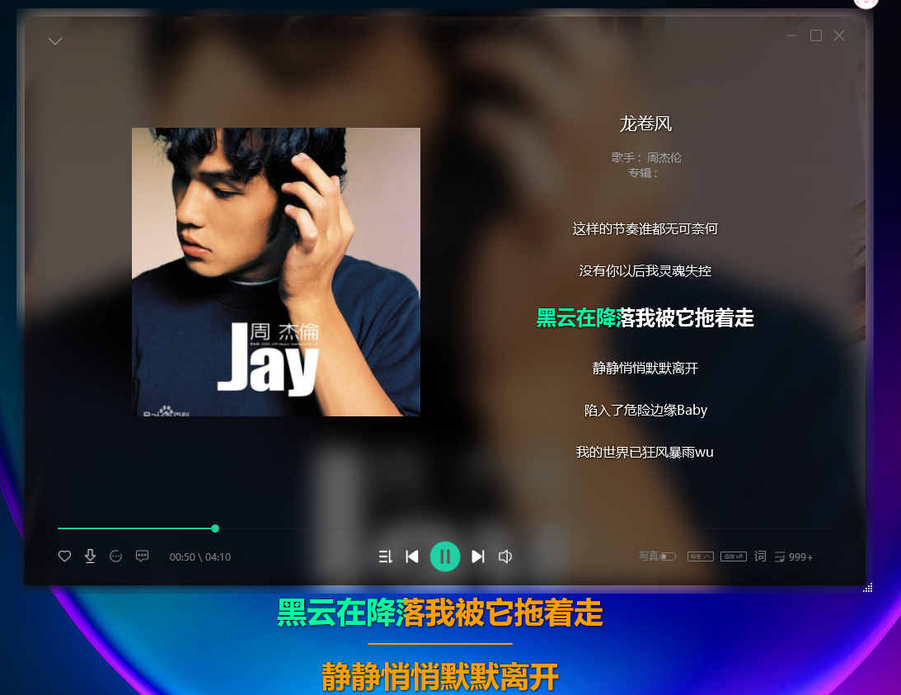

# super-badmen-viper.github.io
夫子墨（墨智AI_Cobra）我的个人主页（my personal homepage）  
theme: Midnight
# 我的QQ学习群号：228440692，欢迎加群，先给个star吧，群里有我整理好的项目，比我的Github的项目更加容易开箱即用
# 基于Apache License 2.0开源协议，你可以随心所欲的截取其中的部分代码，声明：禁止商用，禁止未经作者允许将此解决方案作为教学，论文等知识，商业产权使用（你需要得到我的允许，不然将起诉你的违法行为）
# 我的开源项目：
## 墨智音乐PC版：https://github.com/Super-Badmen-Viper/MoZhiMusicPlayer
   

# 未来预期开源项目DEMO:
## 墨智AI_图形分析系统
## 墨智AI_音频特征提取
## 墨智AI_用户行为分析
## 。。。。。
